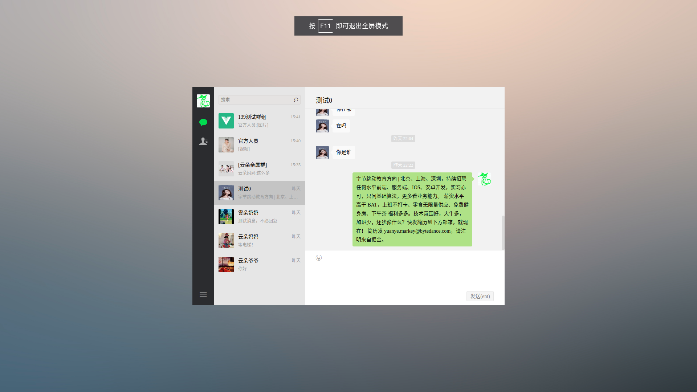
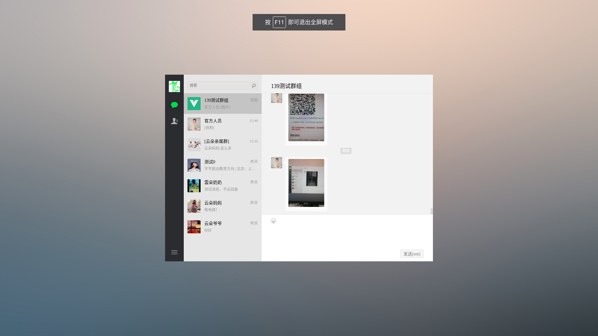
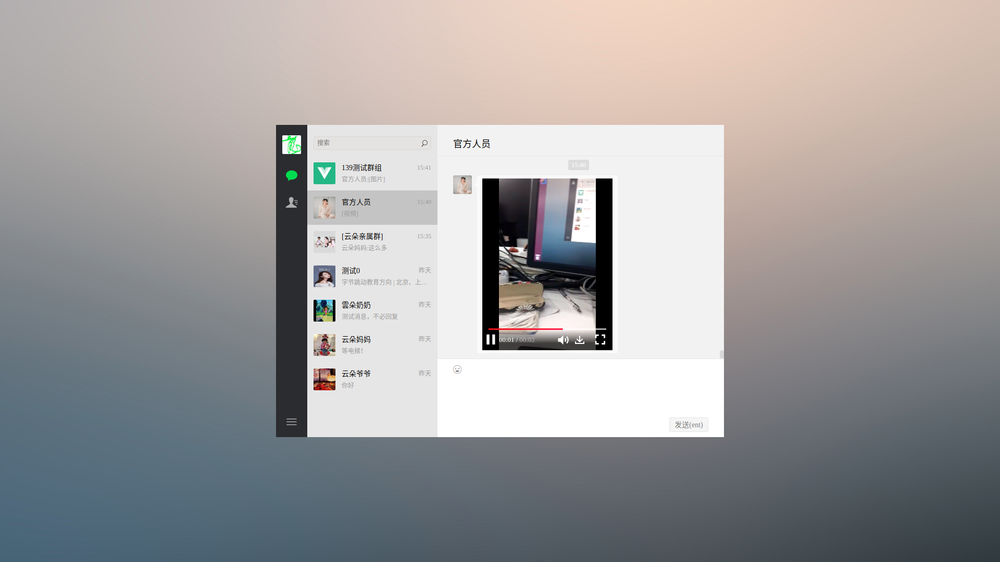

基于[universe-push](https://github.com/comsince/universe_push)的vue即时通讯web端实现，使用websocket进行消息通讯，支持文本，图片类型发送，支持实时音视频，支持音视频与[android-chat](https://github.com/comsince/android-chat)客户端互通

# 项目截图
* 消息提示


* 文字消息



* 图片消息



* 视频消息



# 项目演示
* [项目公测地址](https://chat.comsince.cn)
* 请选择其中任何一个帐号密码进行登录即可
```properties
帐号：13800000000, 13800000001, 13800000002
密码：556677
```
* 暂时停止手机验证码注册登录，后续开通QQ群里面通知

## 版本规划
### V1.0.0
* 登录认证流程
* 实现朋友列表展示，用户信息获取
* 会话信息拉取，会话消息缓存
* 纯文本消息通讯
* 支持图片，视频消息展示
* 群会话功能

### V1.0.1
* 增加全屏幕模式支持，点击用户头像即可切换


### V1.0.2
* 计划增加音视频聊天功能
* 实现与android客户端音视频互通

> 语音通话


> 视频通话


### V1.0.3
* 增加好友搜索，好友添加功能，形成功能闭环

### V1.0.4
* 群组用户列表功能

### V1.0.5-beta
* 增加websocket异步回调接口
* 增加创建群组功能
* 退出群聊
* 撤回消息
* 群组踢人与拉人
* 修改群名称


## Build Setup

``` bash
# install dependencies
npm install

# serve with hot reload at localhost:8080
npm run dev
# 运行请先检查如下配置：TCP服务配置，HTTPS配置，是否支持WSS,是否支持HTTPS，HTTP监听端口8081,HTTPS监听端口8443

# build for production with minification
npm run build

# build for production and view the bundle analyzer report
npm run build --report
```

For detailed explanation on how things work, checkout the [guide](http://vuejs-templates.github.io/webpack/) and [docs for vue-loader](http://vuejs.github.io/vue-loader).


## 参考项目

* [Vue-chat](https://github.com/han960619/Vue-chat/)

## 依赖组件
* [常用的 vue 视频插件](https://wangchaoke.cn/?p=372)
* [西瓜播放器](http://h5player.bytedance.com/gettingStarted)
* [图标Icon支持](https://www.iconfont.cn/manage/index?spm=a313x.7781069.1998910419.11&manage_type=myprojects&projectId=1698562)

## 推荐项目

* [vue-wechat](https://github.com/zhaohaodang/vue-WeChat)
* [vue-chat](https://github.com/aermin/vue-chat)
* [QRCodeLogin](https://github.com/HeyJC/QRCodeLogin/blob/master/Web/auth/src/components/Input.vue) 说明二维码和密码登录的切换操作