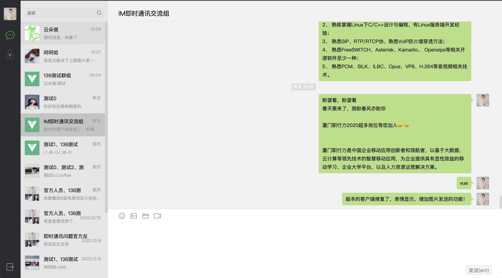

# vue-chat

基于[universe-push](https://github.com/comsince/universe_push)的vue即时通讯web端实现，使用websocket进行消息通讯

# 项目截图
* 消息提示


* 文字消息


* 图片消息


* 视频消息


# 项目演示
* [项目演示地址](http://www.comsince.cn/chat/index.html)
* 请选择其中任何一个帐号密码进行登录即可
```properties
帐号：13800000000, 13800000001, 13800000002
密码：556677
```

## 版本规划
**NOTE:** web版本目前只实现了，消息的发送主体功能，至于添加用户等朋友相关请使用[android版本客户端](https://githu.com/comsince/android-chat)
### V1.0.0
* 登录认证流程
* 实现朋友列表展示，用户信息获取
* 会话信息拉取，会话消息缓存
* 纯文本消息通讯
* 支持图片，视频消息展示
* 群会话功能

### V1.0.1
* 增加全屏幕模式支持，点击用户头像即可切换

### V1.0.2
* 计划增加音视频聊天功能
* 实现与android客户端音视频互通



## Build Setup

``` bash
# install dependencies
npm install

# serve with hot reload at localhost:8080
npm run dev

# build for production with minification
npm run build

# build for production and view the bundle analyzer report
npm run build --report
```

For detailed explanation on how things work, checkout the [guide](http://vuejs-templates.github.io/webpack/) and [docs for vue-loader](http://vuejs.github.io/vue-loader).


## 参考项目

* [Vue-chat](https://github.com/han960619/Vue-chat/)

## 依赖组件
* [常用的 vue 视频插件](https://wangchaoke.cn/?p=372)
* [西瓜播放器](http://h5player.bytedance.com/gettingStarted)

## 推荐项目

* [vue-wechat](https://github.com/zhaohaodang/vue-WeChat)
* [vue-chat](https://github.com/aermin/vue-chat)
* [QRCodeLogin](https://github.com/HeyJC/QRCodeLogin/blob/master/Web/auth/src/components/Input.vue) 说明二维码和密码登录的切换操作